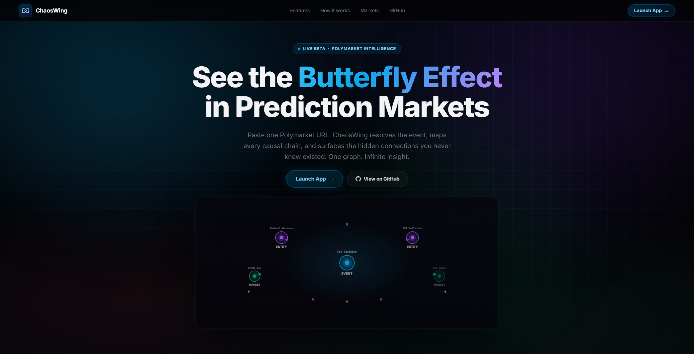
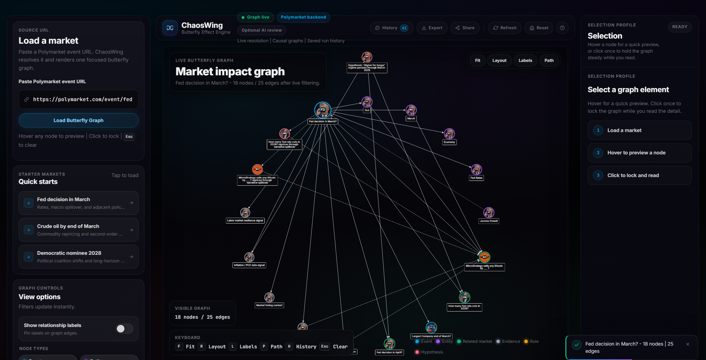
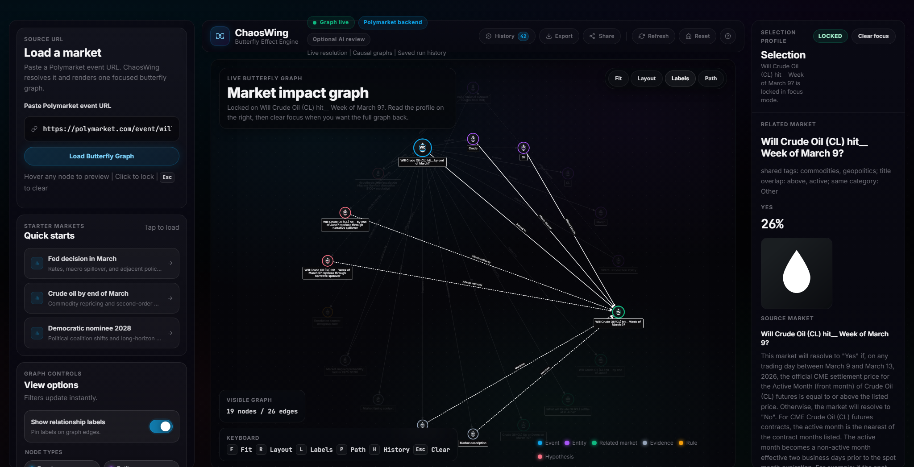

# ChaosWing

ChaosWing is a prediction-market research and evaluation platform for resolution forecasting, related-market ranking, and cross-venue lead-lag analysis, with a graph-based analyst interface for briefs, investigation, and benchmarking.

**Live site:** https://chaoswing.onrender.com


## GitHub Description

Prediction-market research platform for forecasting, ranking, and lead-lag analysis with a graph-based analyst interface.

## Core Research Tasks

- Resolution forecasting: predict whether a binary Polymarket event resolves `YES` from historical market state, then compare the challenger against the market-implied baseline.
- Related-market ranking: rank adjacent markets by trader usefulness and spillover relevance instead of relying only on lexical overlap.
- Cross-venue lead-lag analysis: test whether candidate Polymarket and Kalshi timing signals survive latency, slippage, and paper-trade evaluation.

ChaosWing's graph workspace, briefs, watchlists, and APIs are the analyst interface on top of those tasks, not the project headline.

## Datasets and Labels

- Historical market snapshots: persisted `MarketSnapshot` rows and exported snapshot records in `ml_data/snapshots.jsonl`.
- Resolution labels: binary YES/NO outcomes propagated across resolved event histories and exported in `ml_data/resolution_labels.jsonl`.
- Forecast examples: snapshot-level training and evaluation rows in `ml_data/resolution_forecast_examples.jsonl`.
- Related-market ranking examples: persisted source-market and candidate-market benchmark rows in `ml_data/related_market_ranking_examples.jsonl`.
- Human usefulness labels: reviewer-aware related-market judgments and consensus states in `ml_data/related_market_judgments.jsonl` and `ml_data/related_market_usefulness_examples.jsonl`.
- Cross-venue research artifacts: mapped markets, ticks, screened pairs, candidate signals, and paper trades exported under `ml_data/crossvenue_market_map.jsonl`, `ml_data/market_event_ticks.jsonl`, `ml_data/leadlag_pairs.jsonl`, `ml_data/leadlag_signals.jsonl`, and `ml_data/paper_trades.jsonl`.
- Secondary AI-system evaluation data: saved agent traces and experiment summaries in `ml_data/agent_traces.jsonl` and `ml_data/experiments.jsonl`.

## Current Evaluation Tracks

| Task | Baseline | Challenger / Evaluation Set | Metrics | Status |
| --- | --- | --- | --- | --- |
| Resolution forecasting | Market-implied YES probability | Expanding-window logistic model over historical snapshot features | Brier score, log loss, calibration error, accuracy | Live baseline benchmark |
| Related-market ranking | Lexical overlap over source and candidate titles | Context-aware reranker using graph-context tokens, category hints, and popularity penalties | Recall@3, NDCG@5, MRR | Live silver benchmark |
| Human-labeled related-market usefulness | Reviewer-aware consensus labels over surfaced candidates | Judged evaluation set for the ranking track | NDCG@5, MRR, agreement, coverage | Live judged benchmark |
| Cross-venue lead-lag analysis | Screened candidate signals and paper-trade ledger | Research / falsification track over mapped Polymarket and Kalshi pairs | Hit rate, slippage-adjusted return, latency decay | Research track under validation |
| Graph quality scoring | Persisted review quality labels | Heuristic graph-quality scorer | MAE, RMSE | Secondary evaluation track |
| Agent trust | Structural support and citation coverage checks | Saved-run trust benchmark over graph payloads and staged traces | Trust score, unsupported-claim rate, citation-backed stage rate | Secondary evaluation track |

## Analyst Interface

- `/app/` and the Cytoscape workspace expose the graph as an explainability and investigation layer for forecasting, ranking, and spillover hypotheses.
- `/briefs/<uuid>/` turns saved runs into shareable analyst briefs with strongest-path summaries, ranked adjacent markets, evidence, and caveats.
- `/benchmarks/` and the public APIs surface the measurable layer: backtests, judged benchmarks, dataset coverage, and experiment artifacts.
- `/watchlists/` packages recurring macro, commodity, and political narratives into reusable starting points for research sessions.

## Product Preview

<p align="center">
  
</p>

<p align="center">
  
  
</p>

## Research Workflow

Given one Polymarket event URL, ChaosWing:

1. Resolves the source market from Polymarket's public Gamma API.
2. Persists live market metadata such as title, outcomes, probabilities, volume, liquidity, and image data into replayable run and snapshot artifacts.
3. Discovers and ranks adjacent markets using shared tags, shared terms, narrative overlap, and graph-context signals.
4. Builds a typed graph with `Event`, `Entity`, `RelatedMarket`, `Evidence`, `Rule`, and `Hypothesis` nodes to support explainability and hypothesis inspection.
5. Renders the result in a Django-served, Cytoscape.js-powered workspace plus a shareable analyst brief.
6. Optionally runs an Anthropic review and graph-expansion pass when LLM support is enabled.
7. Stores runs, traces, labels, and experiment artifacts so the same workflow can be replayed, reviewed, exported, and benchmarked.

## Analyst and API Surface

- `/` renders the public landing page around research tasks, benchmark tracks, and the analyst workflow.
- `/app/` renders the main analyst workspace and graph explorer.
- `/briefs/<uuid>/` renders a shareable research brief for a saved run.
- `/watchlists/` exposes curated macro, commodity, and politics watchlists.
- `/lead-lag/` exposes the cross-venue lead-lag monitor, signal diagnostics, and paper-trade ledger.
- `/benchmarks/` shows the live evaluation layer and next research tracks.
- `/benchmarks/review/related-markets/` exposes the manual review queue for related-market usefulness labels, second-pass review, and disagreement resolution.
- `/developers/api/` renders the public developer reference with request/response examples and rate-limit notes.
- `GET /api/` returns the discovery document for the public API.
- `GET /api/openapi.json` returns the generated OpenAPI 3.1 schema.
- `POST /api/v1/graph/from-url/` resolves a Polymarket URL and returns the graph payload.
- `GET /api/v1/runs/` lists saved graph runs.
- `GET /api/v1/runs/<uuid>/` loads a saved run.
- `GET /api/v1/runs/<uuid>/brief/` returns the structured brief JSON for a saved run.
- `GET /api/v1/runs/<uuid>/related-markets/` returns the full related-market ranking.
- `GET /api/v1/runs/<uuid>/changes/` returns the run-to-run change summary.
- `GET /api/v1/benchmarks/summary/` returns the current evaluation snapshot.
- `GET /api/v1/benchmarks/related-market-review/` returns the current related-market review queue with reviewer-aware consensus states.
- `POST /api/v1/benchmarks/related-market-review/submit/` persists a manual related-market usefulness label.
- `GET /api/v1/lead-lag/summary/` returns the current lead-lag monitor snapshot.
- `GET /api/v1/lead-lag/signals/` returns recent candidate and no-trade signals.
- `GET /api/v1/lead-lag/pairs/` returns scored cross-venue pairs.
- `GET /api/v1/lead-lag/pairs/<id>/` returns pair diagnostics plus recent signals and paper trades.
- `GET /api/v1/watchlists/` returns available watchlists.
- `POST /api/v1/runs/<uuid>/review/` triggers a review pass for a saved run.

## Research and Interface Features

- Historical market snapshots, resolution labels, related-market examples, judged usefulness labels, and cross-venue research artifacts exported under `ml_data/`.
- Resolution forecasting backtests that compare a market-implied probability baseline against an expanding-window logistic challenger.
- Related-market ranking benchmarks that compare lexical overlap against a context-aware reranker, plus judged usefulness evaluation from reviewer-aware labels.
- Shareable research briefs with strongest path, top related markets, key evidence, catalyst hints, and confidence caveats.
- Interactive Cytoscape.js spillover graph with pan, zoom, relayout, hover preview, and click-to-lock inspection.
- Public benchmark dashboard backed by persisted runs, experiment logs, and dataset coverage signals.
- Manual review queue for human related-market judgments, with reviewer-aware consensus labels that upgrade the ranking benchmark from silver labels to defensible ground truth.
- Stage-level agent traces now capture deterministic latency across planner/retriever/verifier paths, and Anthropic traces can estimate cost from model-family pricing or explicit environment overrides.
- Cross-venue market mapping, live tick persistence, candidate lead-lag signals, and a paper-trade ledger for falsifying the alpha thesis honestly.
- Curated public watchlists for reusable macro, commodity, and politics research narratives.
- Backfillable staged agent traces so older runs can be reconstructed into the same planner/retriever/graph-editor/verifier/critic pipeline model as new runs.
- Live Polymarket resolution backed by the Gamma API, with graceful fallback behavior when remote resolution is unavailable.
- Confidence-aware edges, related-market discovery, strongest-path focus, export, shareable brief URLs, and run history.
- Django templates for the application shell, with modular Vanilla JavaScript for graph behavior, inspector rendering, controls, and toolbar actions.
- Environment-driven configuration suitable for a public GitHub repository.

## Platform and Research Stack

- Python 3.12+
- Django 5+
- Vanilla JavaScript with ES modules
- Cytoscape.js
- SQLite for local persistence
- DuckDB-ready dataset exports for offline analytics
- Jupyter notebooks with pandas, matplotlib, and seaborn for offline research artifacts
- Anthropic Claude Sonnet 4.6 for optional graph review and expansion

## Quick Start

### 1. Clone the repository

```powershell
git clone https://github.com/Zwc-11/Chaoswing.git
cd Chaoswing
```

### 2. Create and activate a virtual environment

```powershell
py -3.12 -m venv .venv
.venv\Scripts\Activate.ps1
```

### 3. Install dependencies

```powershell
python -m pip install --upgrade pip
python -m pip install -e .
```

Optional research extras for notebooks and offline analysis:

```powershell
python -m pip install -e ".[research]"
```

Optional MLflow extras for local experiment tracking:

```powershell
python -m pip install -e ".[mlops]"
```

### 4. Configure environment variables

Copy the example file:

```powershell
Copy-Item .env.example .env
```

Then edit `.env` as needed.

Minimal local setup:

```env
DJANGO_SECRET_KEY=replace-with-a-long-random-secret
DJANGO_DEBUG=1
CHAOSWING_ENABLE_REMOTE_FETCH=1
CHAOSWING_ENABLE_LLM=0
```

To enable Anthropic-backed review and expansion:

```env
CHAOSWING_ENABLE_LLM=1
ANTHROPIC_API_KEY=your-key-here
ANTHROPIC_MODEL=claude-sonnet-4-6
```

### 5. Apply migrations and run the server

```powershell
python manage.py migrate
python manage.py runserver
```

Open `http://127.0.0.1:8000/`.

## Configuration

ChaosWing reads runtime settings from environment variables through [`chaoswing/config.py`](chaoswing/config.py). Important variables:

| Variable | Default | Purpose |
| --- | --- | --- |
| `DJANGO_SECRET_KEY` | `django-insecure-chaoswing-local` | Django secret key. Set explicitly outside local development. |
| `DJANGO_DEBUG` | `1` | Enables development mode when true. |
| `DJANGO_ALLOWED_HOSTS` | `127.0.0.1,localhost` | Comma-separated host allowlist. |
| `DJANGO_CSRF_TRUSTED_ORIGINS` | empty | Trusted origins for CSRF validation. |
| `CHAOSWING_ENABLE_REMOTE_FETCH` | `1` | Enables live Polymarket resolution. |
| `CHAOSWING_ENABLE_LLM` | `0` | Enables Anthropic graph expansion and review. |
| `ANTHROPIC_API_KEY` | empty | Anthropic API key. |
| `ANTHROPIC_MODEL` | `claude-sonnet-4-6` | Anthropic model identifier. |
| `CHAOSWING_HTTP_TIMEOUT_SECONDS` | `8` | Timeout for outbound HTTP requests. |
| `CHAOSWING_LOG_LEVEL` | `INFO` | Application log level. |
| `CHAOSWING_BENCHMARK_CACHE_TTL` | `120` | Cache TTL in seconds for landing-page and benchmark summary surfaces. |
| `CHAOSWING_MLFLOW_TRACKING_URI` | `sqlite:///mlflow.db` | Local or remote MLflow tracking URI used by the golden-dataset evaluation command. |
| `CHAOSWING_MLFLOW_EXPERIMENT` | `ChaosWing` | Default MLflow experiment name for local benchmark logging. |
| `CHAOSWING_KALSHI_ACCESS_KEY_ID` | empty | Optional Kalshi API key id for signed websocket streaming. |
| `CHAOSWING_KALSHI_PRIVATE_KEY_PATH` | `secrets/kalshi_api_key.pem` | Local PEM path used to sign the Kalshi websocket handshake. |

## Architecture

ChaosWing is structured as a modular monolith.

```text
chaoswing/
|-- apps/web/
|   |-- services/
|   |   |-- polymarket.py
|   |   |-- graph_builder.py
|   |   |-- graph_workflow.py
|   |   |-- anthropic_agent.py
|   |   `-- icons.py
|   |-- static/web/
|   |   |-- css/
|   |   `-- js/
|   |-- templates/web/
|   |-- api_views.py
|   |-- partial_views.py
|   |-- views.py
|   `-- urls.py
|-- chaoswing/
|   |-- config.py
|   |-- settings.py
|   `-- urls.py
|-- docs/
|-- tests/
`-- manage.py
```

### Backend responsibilities

- Resolve live Polymarket event data.
- Build a typed graph payload from market context and related events.
- Optionally enrich and review the graph with Anthropic.
- Persist `GraphRun`, `MarketSnapshot`, `ResolutionLabel`, `AgentTrace`, and `ExperimentRun` records for replay, analytics, and evaluation.
- Persist `RelatedMarketJudgment` labels so ranking benchmarks can be re-run against human usefulness judgments.

### Frontend responsibilities

- Render the three-panel application shell.
- Load graph payloads from Django endpoints.
- Drive Cytoscape.js rendering and interactions.
- Manage hover preview, click-to-lock selection, filtering, history, export, and sharing.

## Development Commands

```powershell
python manage.py check
python manage.py test
python manage.py sync_crossvenue_market_map
python manage.py stream_live_ticks --duration-seconds 60 --iterations 0 --rebuild-pairs-every 1 --scan-signals-every 1 --run-paper-trader --transport hybrid --active-pairs-only
python manage.py collect_live_ticks --iterations 12 --poll-seconds 5 --active-pairs-only
python manage.py build_leadlag_pairs
python manage.py run_leadlag_backtest
python manage.py run_paper_trader
python manage.py collect_market_snapshots
python manage.py run_live_snapshot_collector --poll-seconds 300 --recent-run-limit 12 --trending-limit 6
python manage.py label_resolved_markets --refresh-remote
python manage.py build_benchmark_dataset
python manage.py run_resolution_backtest --refresh-labels --refresh-remote
python manage.py run_related_market_ranking_benchmark
python manage.py run_related_market_usefulness_benchmark --min-reviewers-per-candidate 1
python manage.py run_golden_dataset_eval --strategy baseline --log-mlflow
python manage.py run_quality_backtest
python manage.py backfill_agent_pipeline_traces
python manage.py run_agent_eval --backfill-missing
python manage.py run_agent_trust_benchmark
python manage.py verify_chaoswing
python manage.py export_benchmark_report --pretty
python manage.py run_graph_agent "https://polymarket.com/event/fed-decision-in-march-885"
python manage.py review_graph_run <run-uuid>
```

If you want explicit Anthropic pricing overrides instead of the built-in model-family defaults, set:

```env
CHAOSWING_ANTHROPIC_INPUT_COST_PER_MTOK=3
CHAOSWING_ANTHROPIC_OUTPUT_COST_PER_MTOK=15
```

### Live data collection

Use the one-shot collector when you want a single persisted batch:

```powershell
python manage.py collect_market_snapshots --recent-run-limit 8 --trending-limit 4
```

Use the live collector when you want ChaosWing to keep polling and writing new `MarketSnapshot` rows:

```powershell
python manage.py run_live_snapshot_collector --poll-seconds 300 --recent-run-limit 12 --trending-limit 6
```

Add explicit event URLs to pin important markets into the collection pool, and use `--iterations 1` when you want a smoke run instead of a continuous loop.

When you want to turn saved open snapshots into a stronger forecasting dataset, refresh the unresolved event families and then rerun the rolling backtest:

```powershell
python manage.py label_resolved_markets --refresh-remote
python manage.py run_resolution_backtest --refresh-labels --refresh-remote
```

ChaosWing only promotes the resolution benchmark to the live benchmark board after it has at least a small defensible evaluation set, rather than pretending one or two resolved examples are enough.

### Golden dataset + MLflow

ChaosWing's most defensible local "golden dataset" path is the human-labeled related-market usefulness set. It lets you evaluate the non-ML lexical baseline or the context-aware reranker against reviewer judgments, then log that run to local MLflow without needing Databricks.

Use the review queue to create labels first:

```powershell
http://127.0.0.1:8000/benchmarks/review/related-markets/
```

Then run the golden-dataset evaluation:

```powershell
python manage.py run_golden_dataset_eval --strategy baseline --log-mlflow --mlflow-tracking-uri sqlite:///mlflow.db
```

`--strategy baseline` treats the lexical overlap ranker as the headline score, which is useful when you want a "without ML model" benchmark. `--strategy model` uses the context-aware reranker, and `--strategy compare` logs both plus lift.

By default this command exports `ml_data/golden_related_market_usefulness.jsonl`, persists a `golden_dataset_eval` experiment row in ChaosWing, and can log the run to local MLflow. The SQLite tracking URI is the recommended local default because plain filesystem tracking is being phased out upstream.

### Cross-venue lead-lag research

Sync the Polymarket and Kalshi market catalog, stream low-latency research ticks, build screened pairs, then run the paper-trading benchmark:

```powershell
python manage.py sync_crossvenue_market_map
python manage.py stream_live_ticks --duration-seconds 60 --iterations 0 --rebuild-pairs-every 1 --scan-signals-every 1 --run-paper-trader --transport hybrid --active-pairs-only
python manage.py build_leadlag_pairs
python manage.py run_leadlag_backtest
python manage.py run_paper_trader
```

This subsystem is deliberately framed as a research and alert layer, not a claim of deployable arbitrage. ChaosWing persists the raw ticks, pair scores, candidate signals, and paper trades so the thesis can be falsified honestly.

Use `stream_live_ticks` when you care about seconds-to-minutes lead-lag. It uses a websocket-first hybrid path: Polymarket streams over its public market websocket, and Kalshi switches to its signed websocket path when `CHAOSWING_KALSHI_ACCESS_KEY_ID` plus `CHAOSWING_KALSHI_PRIVATE_KEY_PATH` are configured. Otherwise the command stays honest and reports a poll fallback for Kalshi.

For continuous collection, use `--iterations 0` and let the command supervise repeated stream sessions with reconnects. `--rebuild-pairs-every`, `--scan-signals-every`, and `--run-paper-trader` turn it into a single long-running lead-lag worker instead of a one-off transport check.

Use `collect_live_ticks` when you want a simpler poll-only batch collector or a deterministic fixture ingest path for tests.

### Agent trace backfill

Older saved runs can be upgraded into the staged agent workflow model without rerunning the original market fetch:

```powershell
python manage.py backfill_agent_pipeline_traces
python manage.py run_agent_eval --backfill-missing
```

That reconstructs `planner`, `retriever`, `graph_editor`, `critic`, and `verifier` traces from persisted run payloads and workflow logs, then scores the benchmark against the repaired trace set.
The backfill path is idempotent for those required stages, and the benchmark normalizes one canonical required-stage trace per run so repeated repair jobs do not inflate coverage.

Use `--active-pairs-only` once you have a synced pair registry; it keeps collection focused on the current watch universe instead of burning requests on unrelated catalog rows.

If the live Polymarket and Kalshi catalogs do not overlap enough to support defensible pair construction, the monitor now reports `insufficient_overlap` and stays in research-only mode instead of pretending a paper-trading edge exists.

## Testing

The project is covered by Django tests and should pass the following before release:

```powershell
python manage.py check
python manage.py test
python -m compileall chaoswing apps tests
```

## Documentation

Additional design and architecture notes live in:

- [docs/architecture.md](docs/architecture.md)
- [docs/frontend-architecture.md](docs/frontend-architecture.md)
- [docs/api-contracts.md](docs/api-contracts.md)
- [docs/design-principles.md](docs/design-principles.md)
- [docs/benchmark-methodology.md](docs/benchmark-methodology.md)
- [docs/case-studies.md](docs/case-studies.md)
- [docs/resume-bullets.md](docs/resume-bullets.md)
- [notebooks/README.md](notebooks/README.md)

## Contributing

See [CONTRIBUTING.md](CONTRIBUTING.md).

## License

ChaosWing is released under the MIT License. See [LICENSE](LICENSE).
